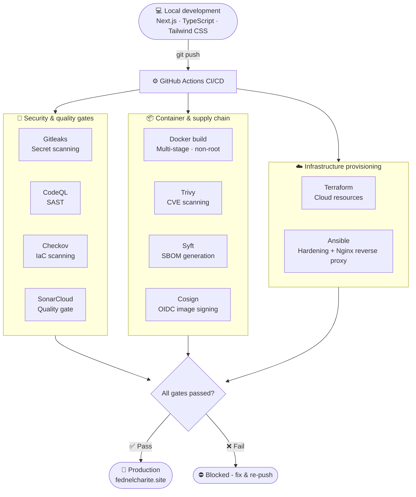

# DevSecOps Portfolio Infrastructure — fednelcharite.site

> Production-grade, security-hardened infrastructure behind a full-stack software engineering portfolio — from `git push` to production, every deployment passes through the same automated security and quality gates.

[](https://github.com/Feddy509/fednelCharite-portfolio/actions/workflows/ci.yml)
[](https://sonarcloud.io/dashboard?id=Fednel_Charite_fednelCharite-portfolio)
[](https://github.com/Feddy509/fednelCharite-portfolio/actions/workflows/ci.yml)
[](https://github.com/gitleaks/gitleaks)
[](https://www.checkov.io/)
[](https://fednelcharite.site)

---

## Overview

This repository holds the application and infrastructure code behind [fednelcharite.site](https://fednelcharite.site) - a full-stack portfolio built not just to showcase software engineering skill, but to demonstrate a security-first, production-grade delivery pipeline in practice.

The application (Next.js, TypeScript, Tailwind CSS) is containerized with Docker, provisioned with Terraform, configured and hardened with Ansible, and gated end-to-end by a DevSecOps pipeline - secret scanning, static analysis, container and dependency scanning, SBOM generation, and signed image supply chain — before anything reaches production.

<details>
<summary>🇫🇷 Aperçu (Français)</summary>
<br>

Ce dépôt contient le code applicatif et l'infrastructure derrière <a href="https://fednelcharite.site">fednelcharite.site</a> - un portfolio full-stack conçu pour démontrer non seulement des compétences en développement logiciel, mais aussi un pipeline de livraison sécurisé et de niveau production, mis en pratique.

L'application (Next.js, TypeScript, Tailwind CSS) est conteneurisée avec Docker, provisionnée avec Terraform, configurée et durcie avec Ansible, et protégée de bout en bout par un pipeline DevSecOps - détection de secrets, analyse statique, analyse des dépendances et des conteneurs, génération de SBOM et signature de la chaîne d'approvisionnement - avant tout déploiement en production.

</details>

---

## Architecture & pipeline



*Zero manual intervention from commit to production - every build passes through the same automated gates before it can ship.*

---

## Tech stack

| Layer | Tools |
|---|---|
| **Application** | Next.js, React, TypeScript, Tailwind CSS |
| **Containerization** | Docker (multi-stage, non-root user), Docker Compose |
| **Infrastructure as Code** | Terraform |
| **Configuration management** | Ansible (server hardening, Nginx reverse proxy) |
| **CI/CD** | GitHub Actions |
| **Code quality** | SonarCloud |
| **Static analysis (SAST)** | CodeQL |
| **Secret scanning** | Gitleaks |
| **IaC scanning** | Checkov |
| **Container scanning** | Trivy |
| **Supply chain security** | Syft (SBOM), Cosign (OIDC image signing) |
| **Package manager** | pnpm |

---

## Security & DevOps features

**Automated security gates & code quality**
- **SonarCloud** - continuous code quality tracking: security ratings, technical debt, test coverage.
- **Gitleaks** - blocks hardcoded API keys and credentials before they ever reach the repository.
- **CodeQL** - static analysis for TypeScript/React vulnerability patterns (XSS, injection).

**Infrastructure & configuration management**
- **Terraform** - provisions clean, reproducible cloud infrastructure.
- **Ansible** - configures target servers, applies system hardening, and sets up Nginx as a secure reverse proxy in front of the Next.js container.

**Container & supply chain**
- **Hardened Dockerfile** - multi-stage build running as an isolated, non-root user (`nextjs:1001`).
- **Trivy** - scans container images for known CVEs.
- **Syft** - generates a Software Bill of Materials (SBOM) for every build.
- **Cosign** - signs container images via OIDC for supply-chain integrity.

<details>
<summary>🇫🇷 Fonctionnalités de sécurité et DevOps (Français)</summary>
<br>

**Contrôles automatisés et qualité du code**
- **SonarCloud** - suivi continu de la qualité du code, des notes de sécurité et de la dette technique.
- **Gitleaks** - bloque l'exposition de clés API et d'identifiants avant tout commit.
- **CodeQL** - analyse statique des failles de sécurité dans TypeScript et React.

**Infrastructure et gestion de configuration**
- **Terraform** - provisionne des ressources cloud propres et reproductibles.
- **Ansible** - configure les serveurs cibles, applique le durcissement système et met en place Nginx comme reverse proxy sécurisé devant le conteneur Next.js.

**Conteneurs et chaîne d'approvisionnement**
- **Dockerfile sécurisé** - construction multi-étapes exécutée sous un utilisateur non-root isolé (`nextjs:1001`).
- **Trivy** - analyse les images de conteneurs à la recherche de CVE connues.
- **Syft** - génère une nomenclature logicielle (SBOM) pour chaque build.
- **Cosign** - signe les images de conteneurs via OIDC pour l'intégrité de la chaîne d'approvisionnement.

</details>

---

## Project structure

```text
fednel-portfolio/
├── .github/workflows/         # CI/CD pipeline definitions
│   └── ci.yml
├── ansible/                   # Configuration management & hardening
│   ├── deploy.yml
│   └── inventory.ini
├── terraform/                 # Infrastructure as Code
│   └── main.tf
├── nginx/
│   └── nginx.conf             # Reverse proxy configuration
├── app/                       # Next.js App Router
│   ├── about/
│   ├── api/
│   │   ├── chat/route.ts
│   │   └── contact/
│   ├── contact/
│   ├── context/LanguageContext.tsx
│   ├── projects/
│   ├── layout.tsx
│   ├── page.tsx
│   └── sitemap.ts
├── components/                # Reusable UI components
│   ├── ChatWidget.tsx
│   ├── Navbar.tsx
│   ├── ProjectCard.tsx
│   ├── ProjectDetailsModal.tsx
│   ├── ResumeModal.tsx
│   └── LanguageSwitcher.tsx
├── data/portfolioData.ts      # Centralized content layer
├── lib/                       # Shared utilities & logging
│   ├── logger.ts
│   └── utils.ts
├── public/                    # Static assets, resumes, certificates
├── Dockerfile                 # Hardened multi-stage build
├── docker-compose.yml
├── sonar-project.properties
├── SECURITY.md
└── README.md
```

---

## Local development

```bash
# Clone the repository
git clone https://github.com/Feddy509/fednelCharite-portfolio.git
cd fednelCharite-portfolio

# Install dependencies
pnpm install

# Run the development server
pnpm dev
```

## Docker & deployment

```bash
# Build the hardened container
docker build -t fednel-portfolio:latest .

# Run it locally
docker run -p 3000:3000 fednel-portfolio:latest
```

---

## Security reporting

For security concerns or vulnerability disclosure, please refer to [SECURITY.md](./SECURITY.md).

---

## Author

**Fednel Charité** - Software Engineer · Aspiring DevSecOps Engineer
Port-au-Prince, Haiti - Open to Remote / Hybrid roles (Local & International)

[Portfolio](https://fednelcharite.site) · [LinkedIn](https://www.linkedin.com/in/fednel-charité-05271823b/) · [GitHub](https://github.com/feddy509)
